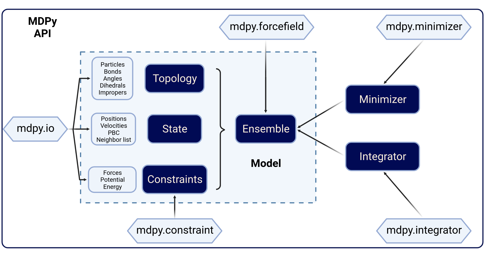

============
Overview
============

MDPy is a **GPU** accelerated Molecular Dynamics (MD) package based on **Python**, distributed freely under the terms of **BSD** License. It is designed for researchers with no c++ or fortran coding background to efficiently implement new theoretical model with GPU acceleration.

MDPy is developed and maintaining by **Zhenyu Wei** (zhenyuwei99@gmail.com), from **Yunfei Chen**'s group in Southeast University. As a newly developed program, we always welcome developers to contact us or discuss in our `Github site <https://github.com/mdpy-dev/mdpy>`_

The document is organized in four parts:

1. **Quick start** contains introduction of our program and the installation suggestions.
2. **Theory behind MDPy** introduce the physical models and mathematical tricks implemented in MDPy.
3. **Tutorial** gives basic example codes to give user a directive intuition of MDPy's features and workflow.
4. **API reference** gives detailed description of all packages and classes of MDPy.

.. tip::

   We strongly recommend beginner of MD simulation to read **Theory behind MDPy** before using MDPy.

.. tip::

   Once user is familiar with MDPy, the **API reference** will be useful for quick code check.

============
Framework
============

In MDPy, he main job of conducting a simulation is creating a well-defined :doc:`Ensemble <../api_reference/core/generated/mdpy.core.Ensemble>` object. A `Ensemble` object included all information required for the MD simulation:

- :doc:`Topology <../api_reference/core/generated/mdpy.core.Topology>` contains the **particles' properties** (e.g: Atom type; Mass; Charge) and the other **topological information** (e.g: Bond, Angle, Dihedrals).
- :doc:`State <../api_reference/core/generated/mdpy.core.State>` contains **spatial coordinates** and **velocities** of each particles in Topology. These information describes the coordinate of Ensemble in the **phase space**. Further, State also contains the information of Periodic Boundary Condition (PBC) and Neighbor list.
- Constraints is a :code:`list` of :doc:`Constraint <../api_reference/constraint/index>` object. Each :code:`Constraint` object describes a **specific interaction between particles**, and returns the **force** on each particles and the **potential energy** of the Ensemble.

.. tip::

   MDPy also provides higher level API for creating typical :code:`Ensemble`, which includes in the :doc:`mdpy.recipe <../api_reference/recipe/index>` package.

Then user can create operations on the :code:`Ensemble` object. MDPy supports two types of operators:

- :doc:`Minimizer <../api_reference/minimizer/index>` takes the :code:`Ensemble` object as the **input** and **minimize** the total **potential energy** of :code:`Ensemble`.
- :doc:`Integrator <../api_reference/integrator/index>` takes the :code:`Ensemble` object as the **input** and **integrate** the **force** acting on each particles in specific manner to sample the **phase space**.

============
Installation
============

**Beta version**

We strongly recommend to install mdpy from **source code** in the Beta version. First you need clone this repository to your local device:

.. code:: bash

    git clone https://github.com/mdpy-dev/mdpy.git

Then go to the path of mdpy, running:

.. code:: bash

    conda install --file requirements.txt -c defaults -c conda-forge
    conda develop .

Now all the change made on the mdpy source code can be reveal in your code without reinstalling mdpy package.

============
Performance
============

=========
Cite MDPy
=========

