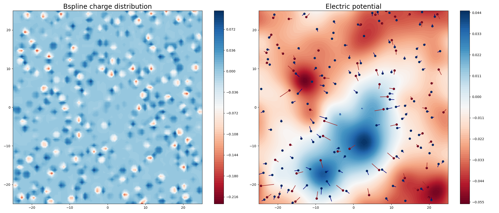

===================
Ewald summation
===================

Background
----------

Different from the short-ranged interactions, the electrostatic interaction describing by the coulomb law will not vanish beyond specific range for a dense system as:

.. math::
    U_{\mathrm{ele}}(r+\mathrm{d}r) =  \frac{q_sq_n}{4\pi\varepsilon_0 r}\times n_0 \pi r^2 dr = n_0 \frac{q_sq_n}{4\varepsilon_0} r \mathrm{d}r
    :label: ewald-sum-eq-long-range-prove

According to Equation :math:numref:`ewald-sum-eq-long-range-prove`, the interaction energy between central particles and their neighboring particles within the range of :math:`[r, r + \mathrm{d}r]` increases linearly as the distance increases. Therefore, it is not feasible to simplify the calculation of electrostatic interaction by setting a cutoff radius and ignoring particles beyond it. Additionally, the presence of periodic boundary conditions (PBC) results in an infinite sum that cannot be easily calculated, further adding to the complexity of the electrostatic interaction calculation.

.. figure:: ../_static/image/ewald_sum/screening.png
    :align: center
    :width: 550

    Idea of ewald summation :cite:`ewald-sum-illstration`

Ewald summation is a mathematical method utilized in computational chemistry and physics to precisely calculate the long-range electrostatic interactions between charged particles in a periodic system. The fundamental concept involves transforming the original delta-like charge distribution into the superposition of a screening distribution and a Gaussian-like distribution, as depicted above. The screening distribution is composed of the original distribution and a Gaussian with an opposite charge sign, **similar** to dipoles. Approximately, the energy is altered to:

.. math::
    U_{\mathrm{ele}}(r+\mathrm{d}r) =  \frac{q_sq_n}{4\pi\varepsilon_0 r^3}\times n_0 \pi r^2 dr = n_0 \frac{q_sq_n}{4\varepsilon_0r} \mathrm{d}r
    :label: ewald-sum-eq-screen-short-range-prove

As the distance increases, the energy now diminishes. Precisely, the energy of the screening distribution can be expressed as follows:

.. math::
    \begin{equation}
    \begin{cases}
        \displaystyle \phi _{\text{G}}(r)=\frac{q}{4\pi \varepsilon _0r}\text{erf(}\alpha r\text{),erf(}x)=\frac{2}{\pi ^{\text{1/}2}}\int_0^x{\text{e}^{-x^2}}\text{d}x \\\\
        \displaystyle \phi _{\delta}(r)=\frac{q}{4\pi \varepsilon _0r}
    \end{cases}
    \label{equation}
    \end{equation}
    :label: ewald-sum-eq-phi-expression

.. math::
    E_{\text{short}}=\sum_{i\ne j,\lVert \mathbf{r}_i-\mathbf{r}_i \rVert \le r_c}^{N_{\text{p}}}{\frac{q_iq_j}{4\pi \varepsilon _0 \lVert \mathbf{r}_i-\mathbf{r}_j \rVert }\left[ 1-\text{erf}\left(\alpha \lVert\mathbf{r}_i-\mathbf{r}_j\rVert\right) \right]}
    :label: ewald-sum-eq-screening-energy

Moreover, for the Gaussian-like distribution, we can substitute the summation in real space with the summation in reciprocal space, since the Gaussian distribution is periodic owing to the presence of PBC. First, considering the Poisson equation in reciprocal space:

.. math::
    \lVert \mathbf{k} \rVert ^2\tilde{\phi}(\mathbf{k})=\frac{\tilde{\rho}(\mathbf{k})}{\varepsilon _0}
    :label: ewald-sum-eq-poisson-reciprocal

, the electric potential of Gaussian-like distribution in the reciprocal space expresses as:

.. math::
    \tilde{\phi}_{\text{G}}(\mathbf{k})=\frac{1}{\varepsilon _0\lVert \mathbf{k} \rVert ^2}\int{\sum_{j=1}^{N_{\text{p}}}{q_j}}G(\mathbf{r}-\mathbf{r}_j\text{)e}^{-i\mathbf{kr}}\text{d}\mathbf{r}=\frac{1}{\varepsilon _0\lVert \mathbf{k} \rVert ^2}\sum_{j=1}^{N_{\text{p}}}{q_j}\exp \left( -\frac{\lVert \mathbf{k} \rVert ^2}{4\alpha ^2}-i\mathbf{kr} \right)
    :label: ewald-sum-eq-phi-reciprocal

Next, we utilize the Poisson summation to convert the potential in reciprocal space into real space and give the potential energy:

.. math::
    \begin{array}{rcl}
        \displaystyle\phi _{\text{G}}(\mathbf{r}) & = &
        \displaystyle \sum_{\mathbf{n}\in \mathbb{Z}^3}{\phi _{\text{G}}}'(\mathbf{r}+\mathbf{nL})=\frac{1}{V}\sum_{\mathbf{k}}{\tilde{\phi}_{\text{G}}}(\mathbf{k}\text{)e}^{i\mathbf{kr}}\\\\
        & = & \displaystyle \frac{1}{\varepsilon _0V}\sum_{\mathbf{k}}{\sum_{j=1}^{N_{\text{p}}}{\frac{q_j}{\lVert \mathbf{k} \rVert ^2}}}\exp \left[ -\frac{\lVert \mathbf{k} \rVert ^2}{4\alpha ^2}-i\mathbf{k}(\mathbf{r}-\mathbf{r}_j) \right]
    \end{array}
    :label: ewald-sum-eq-phi-poisson-summation

.. math::
    E_{\text{G}}=\frac{1}{\varepsilon _0V}\sum_{\mathbf{k}}{\sum_{i,j}^{N_{\text{p}}}{\frac{q_iq_j}{\lVert \mathbf{k} \rVert ^2}}}\exp \left[ -\frac{\lVert \mathbf{k} \rVert ^2}{4\alpha ^2}-i\mathbf{k}(\mathbf{r}_i-\mathbf{r}_j) \right]
    :label: ewald-sum-eq-long-range-potential-energy

The summation over :math:`\mathbf{k}` converges rapidly owing to the presence of :math:`\lVert \mathbf{k} \rVert ^2` in the denominator and the exponential term. However, there are still two issues with Equation :math:numref:`ewald-sum-eq-long-range-potential-energy`: (a) the value of the summation term when k = 0, and (b) the existence of self-interaction. The first question can be resolved when simulating an electroneutral system :cite:`ewald-sum-neutral-system`. In contrast to disregarding all :math:`i=j` pairs in Equation :math:numref:`ewald-sum-eq-screening-energy`, we must manually eliminate the self-interaction term for the second question. The self-interaction term describes the interaction between the delta-like charge and the surrounding same charged Gaussian:

.. math::
    E_{\text{self}}=\sum_{i=1}^{N_{\text{p}}}{\lim_{r\rightarrow 0}}q_i\phi _{\text{G}}(r)=\sum_{i=1}^{N_{\text{p}}}{\frac{\alpha q_{i}^{2}}{2\varepsilon _0\pi ^{\text{3/}2}}}
    :label: ewald-sum-eq-self-energy

Then the total electric potential energy can be written as:

.. math::
    U_{\text{ele}}=E_{\text{short}}+E_{\text{long}}-E_{\text{self}}
    :label: ewald-sum-eq-total-energy

In practical applications, the Fast Fourier Transform (FFT) algorithm is utilized to hasten the calculation of long-range electrostatic interactions, and its implementation necessitates the discretization (griding) of space. Two common algorithms, namely the the Particle Mesh Ewald :cite:`ewald_sum_pme_01,ewald_sum_pme_02` (PME) method and Particle-Particle Particle Mesh :cite:`ewald_sum_p3m_01,ewald_sum_p3m_02` (PPPM or P3M) method, have been introduced to tackle this issue. In MDPy, the PME method is implemented to evaluate electrostatic interactions.

Particle Mesh Ewald
-------------------

    Illustration of: (Right) B-spline interpolation, (Left) Electric potential.

Ewald coefficient
+++++++++++++++++

As shown in Equation :math:numref:`ewald-sum-eq-phi-expression`, the Ewald coefficient :math:`alpha` determines the width of the Gaussian-like charge distribution, which in turn affects the electric potential expression of the screening distribution and the choice of the cutoff radius. In the PME method, the user specifies the cutoff radius :math:`r_c` and error tolerance :math:`e` as the input parameters to calculate the Ewald coefficient. The Ewald coefficient must satisfy the following equation:

.. math::
    e = 1-\text{erf}\left(\alpha \lVert\mathbf{r}_i-\mathbf{r}_j\rVert\right)
    :label: ewald-sum-eq-ewald-coefficient

In MDPy, the Ewald coefficient is calculated by solving Equation :math:numref:`ewald-sum-eq-ewald-coefficient` via the Newton method.

Bspline interpolation
++++++++++++++++++++++