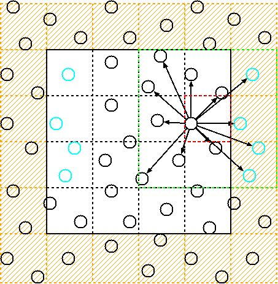
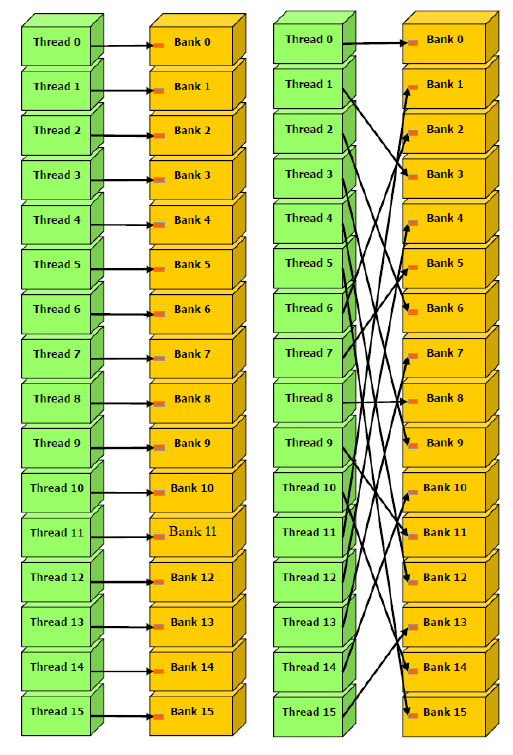
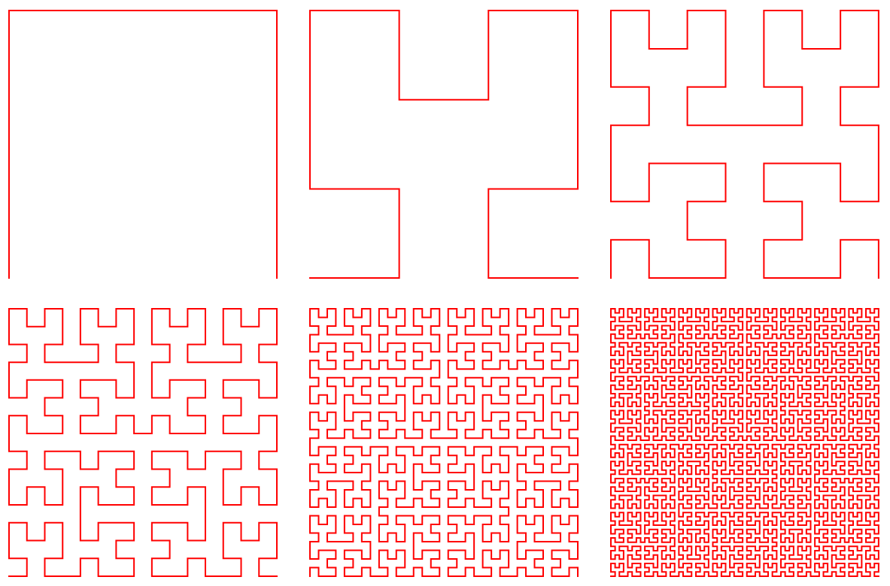
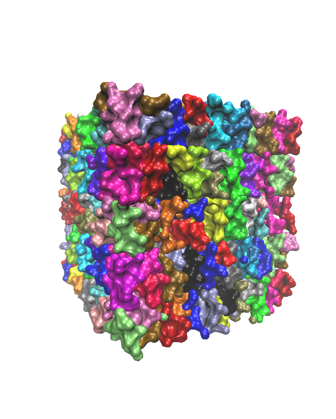

=============
Cell list
=============

Background
----------

In many cases, particles only interact with each other over short distances, and these interactions can be described using short-range potentials.

The Lennard-Jones potential is a common example of a short-range potential used to describe the Van der Waals interaction between particles.

.. math::
    :label: neighbor-list-eq-vdw

    U_{\text{vdw}}=\sum_{i\ne j}^{N_{\text{p}}}{4}\varepsilon _{ij}\left[ \left( \frac{\sigma _{ij}}{r_{ij}} \right) ^{12}-\left( \frac{\sigma _{ij}}{r_{ij}} \right) ^6 \right]

As shown in Eq :math:numref:`neighbor-list-eq-vdw`, the computation of pairwise interactions has a complexity that scales with the square of the number of particles, denoted as :math:`N_{\text{p}}`. This leads to a quadratic increase in computational cost as the number of particles increases. However, since only particles in close proximity to a given central particle have a significant effect on it, it is important to use a data structure that efficiently identifies the neighboring particles.

    Illustration of cell-list :cite:`cell-list-illstration-png`

The cell-list is a data structure commonly used in computational physics and chemistry simulations to efficiently compute pairwise interactions between particles in a system. It works by dividing the simulation domain into a grid of cells and assigning each particle to the cell that contains its position.

By doing this, particles in nearby cells are likely to interact with each other, while particles in distant cells are unlikely to interact. This reduces the number of pairwise interactions that need to be computed, resulting in a significant computational speedup.

The cell-list algorithm consists of several steps. Firstly, the simulation domain is partitioned into a grid of uniformly sized cells, with each cell defined by a cutoff radius that determines the range of particle interactions. Next, each particle is assigned to the cell containing its position, followed by the identification of neighboring cells for each particle. Finally, interactions are calculated only between the central particle and those in its own cell and neighboring cells, as particles outside of these cells are beyond the cutoff radius.

Implementation details
----------------------

Memory coalescing
+++++++++++++++++++

In a typical simulation, a large number of particle coordinates must be repeatedly accessed to calculate interactions during each time step. Therefore, optimizing memory access efficiency is crucial for improving the performance of molecular dynamics (MD) simulations. The data structure of the cell-list should also be optimized to achieve this goal.

    Comparison between coalesced and uncoalesced memory accessing :cite:`cell-list-memory-coalesing-png`. "In this scenario, accessing memory in a coalesced manner requires only one request, whereas accessing memory in an uncoalesced manner requires 32 separate requests.

Memory coalescing is a technique used in computer systems to optimize memory access patterns and improve performance. It involves grouping memory requests from multiple threads or blocks of threads into larger, more contiguous requests.

When a GPU executes a kernel, it does so in parallel across many threads. These threads are grouped into blocks, and each block is assigned to a streaming multiprocessor (SM) on the GPU. When a thread needs to access memory, it issues a memory request. If multiple threads in a block issue memory requests for adjacent locations in memory, these requests can be combined into a single request that reads or writes a larger block of memory.

By grouping memory requests in this way, memory coalescing reduces the number of requests that need to be sent to memory, which can improve overall performance. It also helps to reduce memory bandwidth usage, which can be a bottleneck in GPU performance.

Space filling curve
+++++++++++++++++++

To improve memory coalescence, we aim to access the coordinates of multiple particles simultaneously. In other words, we want to handle groups of particles in similar environments. In MDPy, we group particles in the same cell and close proximity into a **tile** containing 32 or fewer particles to meet GPU requirements. We then re-sequence the coordinates to follow the tile sequence, ensuring that the data of particles in the same tile is contiguous. Finally, each GPU block calculates the interactions between particles in two tiles in center or neighboring cells, allowing each block to access coalesced memory.

    Illustration of the Hilbert curve :cite:`cell-list-space-filling-curve-png`.

MDPy uses a space-filling curve to group particles that are close together in space. A space-filling curve is a mathematical construct that maps a one-dimensional sequence of numbers to a two-dimensional or higher-dimensional space, preserving locality. In other words, it is a curve that traverses a space in a way that maximizes the continuity of nearby points.

The idea behind space-filling curves is that they provide a way to traverse a multi-dimensional space in a linear order, which can be useful for indexing or searching large datasets. By mapping the points in a multi-dimensional space to a one-dimensional sequence, space-filling curves can reduce the overhead of accessing and processing data.

    Space partition result.

The use of a space-filling curve enables us to hash the 3D coordinates of particles to obtain a sequence of particles in each cell. Based on the hashing result, we can construct a tile by re-sequencing the particle hash value.